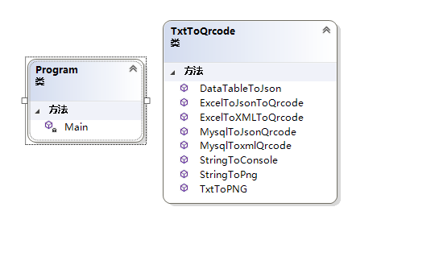

# lab01
## 一、功能概述
   1. 使用QrCode.NET库将字符串变成Qrcode，支持在控制台输出和以png格式保存在文件中。如果在命令行参数中有-f ，在 -f后面的参数传入文件路径
   2. 如果是文本格式，对于其中的每一行的字数串，以行数（3位）+字符串的前4位为文件名，创建其二维码，这些文件存储在txt文件夹中。如果没有命令行中没有-f的参数，则以空格连接命令行参数，将该字符串转换为Qrcode。
## 二、项目特色  
1. 如果是Excel文件，将其中的数据信息以Json和Xml两种方式存储为字符串，并转化为二维码，存储在excel文件夹中，本功能只能获取Excel文件中Sheet1表的信息    
   2.如果在-f后面是mysql，则需要提供连接字符串与查询语句，例如”server=127.0.0.1;port=3306;user=root;password=123456;database=chap1;”与“SELECT * from students”，对于获取到的信息，同样转换为Json和Xml两种数据格式，并存储在mysql文件夹中  
   3.同时，生成了安装包，可以安装在电脑上进行运行与测试。
## 三、代码总量
   500行左右
## 四、工作时间
   6天
## 五、知识点总结图（Concept MAP）
   
## 六、结论
   本次实验过程中，学习并掌握了使用第三方QRCode库，掌握了二维码生成方法。同时，也学习了如何处理文本文件的读写操作，以及如何把二维码存储在png图像中。另外，对与C#处理Excel文件与Mysql数据库表的查询进行了学习与操作。对于Excel的操作比较复杂，需要继续熟练掌握。

